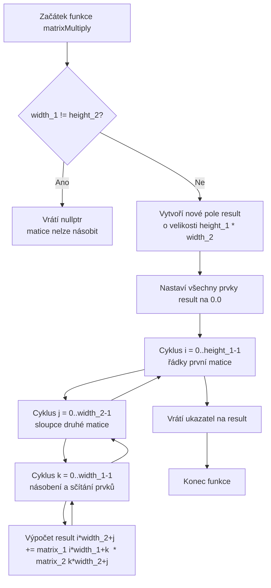

```mermaid
flowchart TD
    A[Začátek funkce matrixMultiply] --> B{width_1 != height_2?}
    B -- Ano --> C[Vrátí nullptr<br>matice nelze násobit]
    B -- Ne --> D[Vytvoří nové pole result<br>o velikosti height_1 * width_2]
    D --> E[Nastaví všechny prvky result na 0.0]
    E --> F[Cyklus i = 0..height_1-1<br>řádky první matice]
    F --> G[Cyklus j = 0..width_2-1<br>sloupce druhé matice]
    G --> H[Cyklus k = 0..width_1-1<br>násobení a sčítání prvků]
    H --> I[Výpočet result i*width_2+j  += matrix_1 i*width_1+k  * matrix_2 k*width_2+j ]
    I --> H
    H --> G
    G --> F
    F --> J[Vrátí ukazatel na result]
    J --> K[Konec funkce]
```