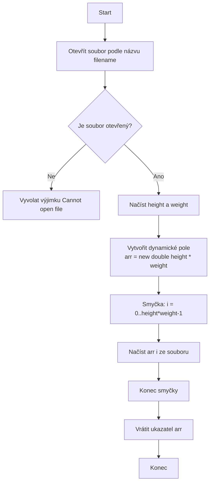

```mermaid
flowchart TD

    A[Start] --> B[Otevřít soubor podle názvu filename]
    B --> C{Je soubor otevřený?}

    C -- Ne --> D[Vyvolat výjimku Cannot open file]
    C -- Ano --> E[Načíst height a weight]

    E --> F[Vytvořit dynamické pole<br/>arr = new double height * weight ]

    F --> G[Smyčka: i = 0..height*weight-1]

    G --> H[Načíst arr i ze souboru]

    H --> I[Konec smyčky]

    I --> J[Vrátit ukazatel arr]

    J --> K[Konec]
```
