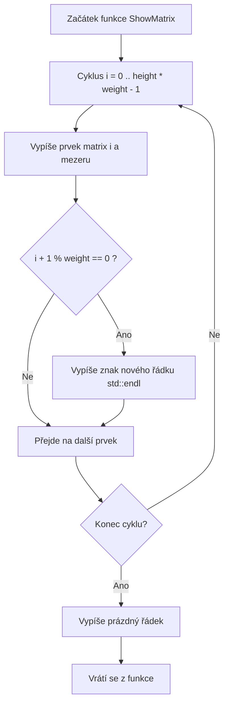

```mermaid
flowchart TD
    A[Začátek funkce ShowMatrix] --> B[Cyklus i = 0 .. height * weight - 1]
    B --> C[Vypíše prvek matrix i a mezeru]
    C --> D{i + 1 % weight == 0 ?}
    D -- Ano --> E[Vypíše znak nového řádku std::endl]
    D -- Ne --> F[Přejde na další prvek]
    E --> F
    F --> G{Konec cyklu?}
    G -- Ne --> B
    G -- Ano --> H[Vypíše prázdný řádek]
    H --> I[Vrátí se z funkce]
```