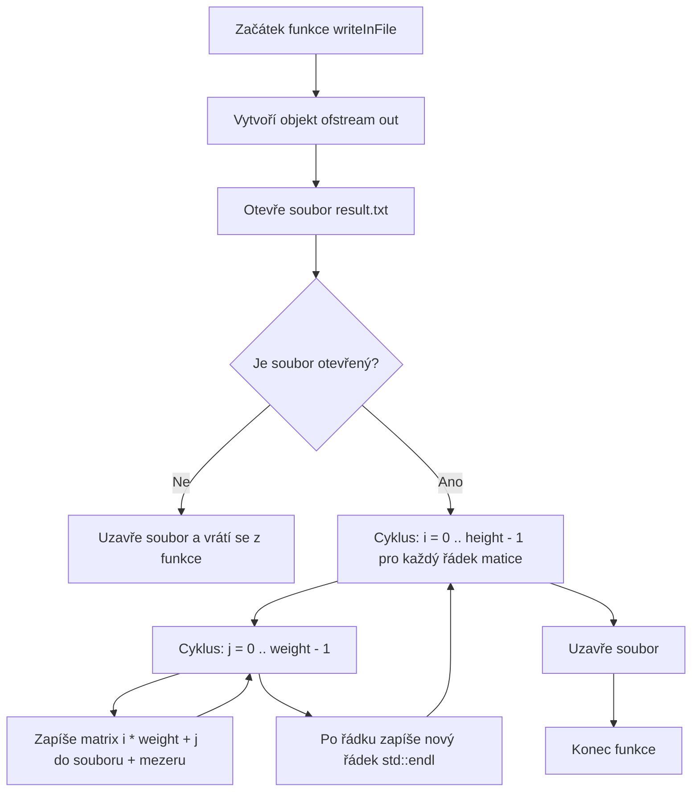

```mermaid
flowchart TD
    A[Začátek funkce writeInFile] --> B[Vytvoří objekt ofstream out]
    B --> C[Otevře soubor result.txt]
    C --> D{Je soubor otevřený?}
    D -- Ne --> E[Uzavře soubor a vrátí se z funkce]
    D -- Ano --> F[Cyklus: i = 0 .. height - 1 pro každý řádek matice]
    F --> G[Cyklus: j = 0 .. weight - 1<br pro každý prvek řádku]
    G --> H[Zapíše matrix i * weight + j  do souboru + mezeru]
    H --> G
    G --> I[Po řádku zapíše nový řádek std::endl]
    I --> F
    F --> J[Uzavře soubor]
    J --> K[Konec funkce]
```
